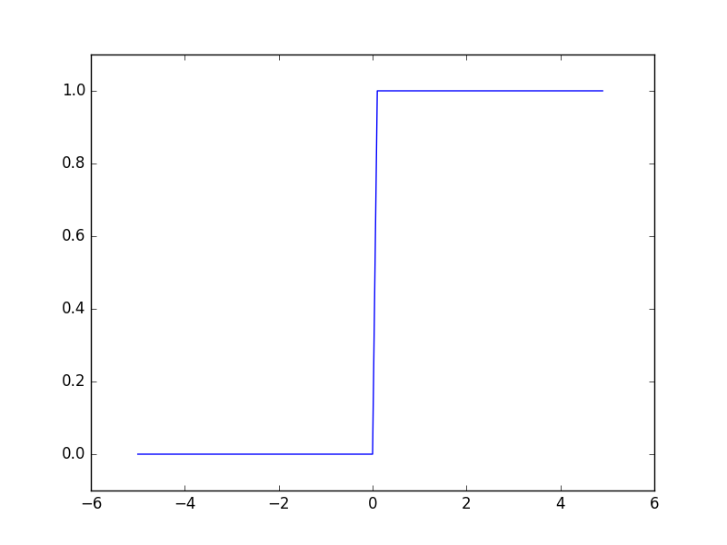
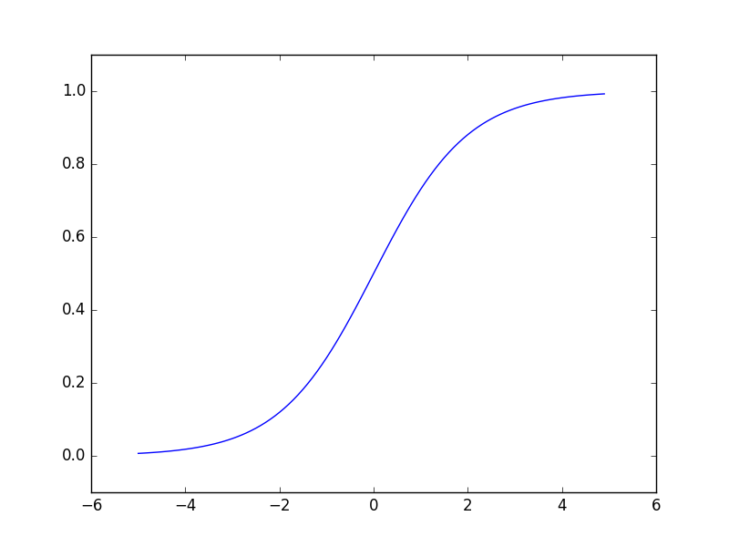
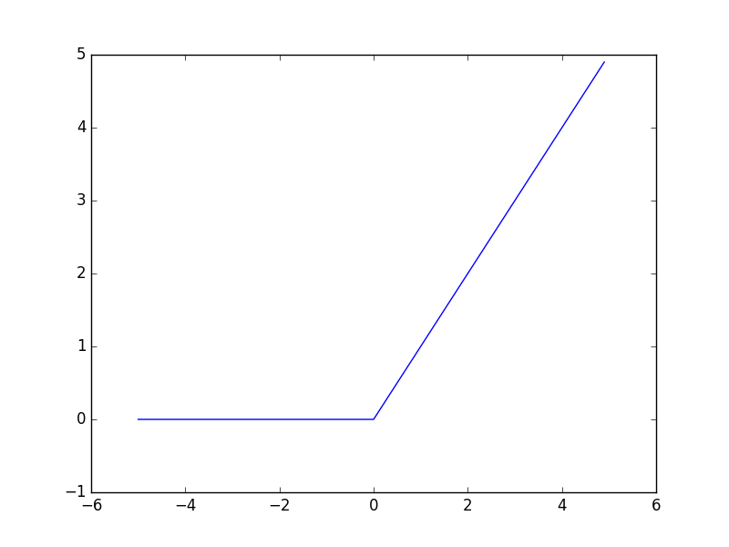

## 3.2 活性化関数

### 3.2.3 ステップ関数のグラフ
ステップ関数
```python
def step_function(x):
  return np.array(x > 0, dtype = np.int)
```

[step_function.py](./step_function.py)
```python
import numpy as np
import matplotlib.pylab as plt


def step_function(x):
    return np.array(x > 0, dtype = np.int)


x = np.arange(-5.0, 5.0, 0.1)
y = step_function(x)

plt.plot(x,y)
plt.ylim(-0.1, 1.1)
plt.show()

```




### 3.2.4 シグモイド関数の実装
シグモイド関数
```python
def sigmoid(x):
  return 1 / (1 - np.exp(-x))
```

[sigmoid.py](./sigmoid.py)
```python
import numpy as np
import matplotlib.pylab as plt


def sigmoid(x):
    return 1 / (1 + np.exp(-x))


x = np.arange(-5.0, 5.0, 0.1)
y = sigmoid(x)

plt.plot(x,y)
plt.ylim(-0.1, 1.1)
plt.show()

```



### 3.2.6 非線形関数

### 3.2.7 ReLU関数
Rectified Linear Unit関数   
x<0のとき0をx>=0のときxを返す関数。  


ReLU関数
```python
def relu(x):
  return np.maximum(0,x)
```

[relu.py](./relu.py)
```python
import numpy as np
import matplotlib.pylab as plt


def relu(x):
    return np.maximum(0,x)


x = np.arange(-5.0, 5.0, 0.1)
y = relu(x)

plt.plot(x,y)
plt.ylim(-1.0, 5.0)
plt.show()

```


